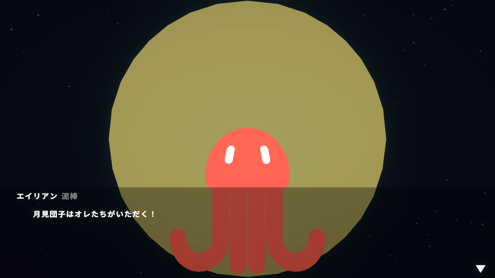
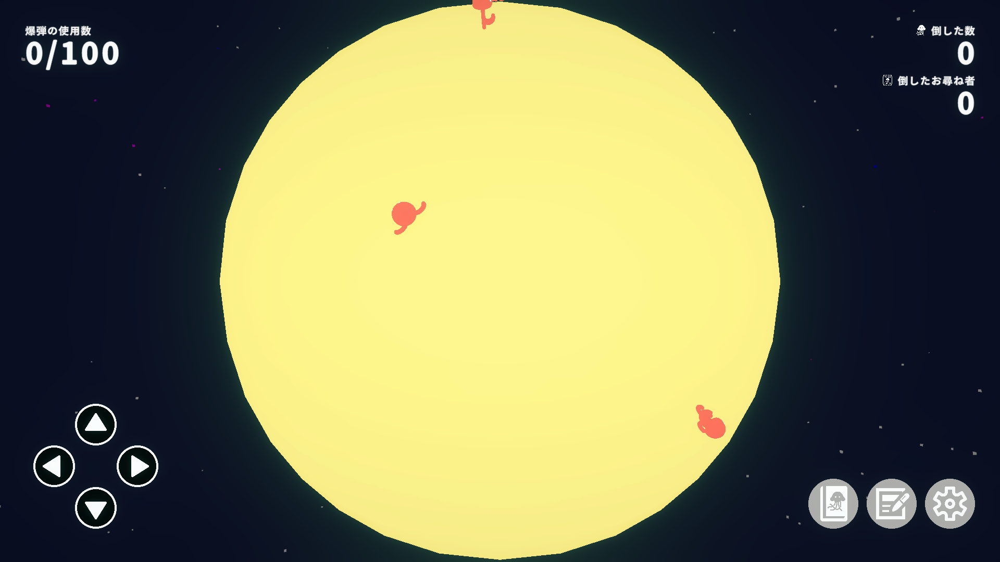
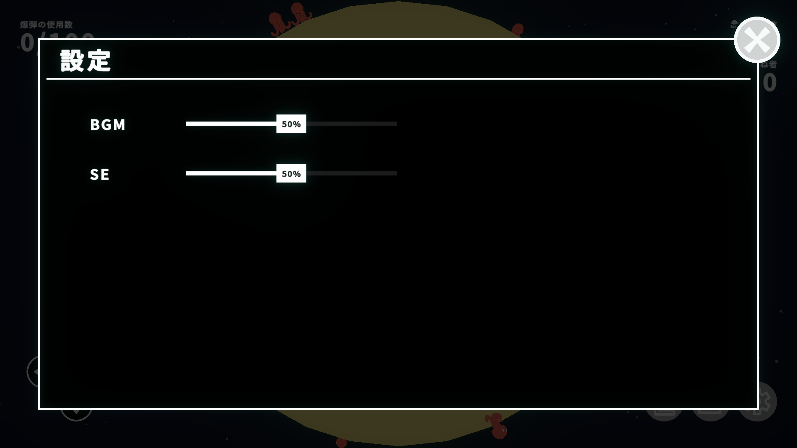
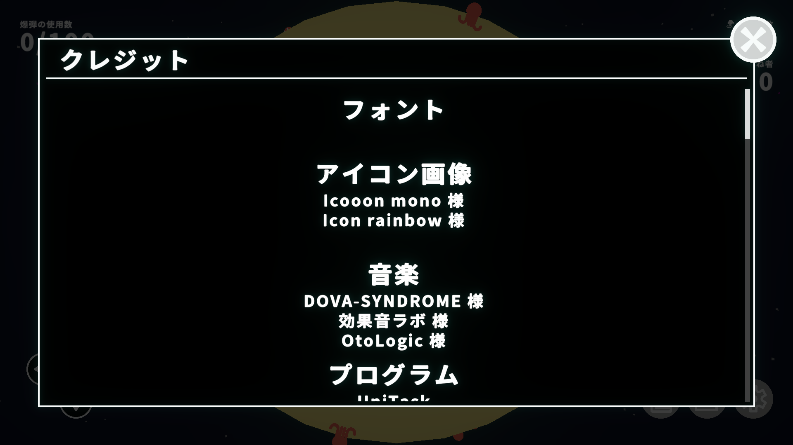

## スクリーンショット

| 会話画面 | ゲーム画面 |
| :------ | :------- | 
|  |  |

| 図鑑画面 | 設定画面 |
| :------ | :----- | 
|  |  |

| クレジット画面 |
| :--------- |
|  |

## 使用技術一覧

  <!-- ミドルウェアまたはフレームワーク、ライブラリ一覧 -->
  

## 開発期間
2025.09.29 〜 2025.10.6（8日間） 
制作人数 1人

## 目次

1. [開発のきっかけ](#開発のきっかけ)
2. [プロジェクトについて](#プロジェクトについて)
3. [環境](#環境)
4. [動作確認](#動作確認)
5. [エラーについて](#エラーについて)
6. [クラス図](#クラス図)
7. [工夫した点](#工夫した点)
8. [修正点](#修正点)
9. [CursorのAIコードエディタについて](#CursorのAIコードエディタについて)
10. [その他の作品](#その他の作品)

## 開発のきっかけ
10月6日の『お月見』に合わせてゲームを作りたいと考え、制作しました。

## プロジェクトについて

プロジェクトの設計はクリーンアーキテクチャを採用しています。 
プロジェクトの構成は7つの層+インゲーム部分で構成しています。 
(APIGateway, Composition, Domain, MasterRepository, Presentation, UseCase, View + Gameplay) 
リンク: [Assets/Project/Core/Scripts](https://github.com/yukikomori332/DangoBakudanSimulator-Public/tree/109712455e25df881236f99c534494f83ac2ba7a/Assets/Project/Core/Scripts)

アウトゲーム部分では、Model - View-ViewState - Presenterのデザインパターンを採用しています。 
リンク: [Assets/Project/Core/Scripts](https://github.com/yukikomori332/DangoBakudanSimulator-Public/tree/109712455e25df881236f99c534494f83ac2ba7a/Assets/Project/Core/Scripts)

インゲーム部分では、Model - View - Presenterのデザインパターンを採用しています。 
リンク: [Assets/Project/Core/Scripts/Gameplay](https://github.com/yukikomori332/DangoBakudanSimulator-Public/tree/109712455e25df881236f99c534494f83ac2ba7a/Assets/Project/Core/Scripts/Gameplay)

## 環境

<!-- 言語、フレームワーク、ミドルウェア、インフラの一覧とバージョンを記載 -->

| ミドルウェア  | バージョン     |
| --------- | ----------- |
| Unity     | 2022.3.62f2 |

| ライブラリ                       | バージョン |
| ----------------------------- | ------- |
| LitMotion                     | 2.0.1   |
| Unitask                       | 2.5.10  |
| Unity Debug Sheet             | 1.5.4   |
| UnityScreenNavigator          | 1.7.0   |
| uPalette                      | 2.5.3   |
| StreamingAssetsInjector       | 1.0.0   |
| Graphy - Ultimate FPS Counter | 3.0.5   |
| UI Effect                     | 5.9.5   |
| uPalette                      | 2.5.3   |
| Unityroom Client Library      | 0.9.6   |
| In-game Debug Console         | 1.8.2   |
| UniRx                         | 7.1.0   |

| ツール             | バージョン |
| ----------------- | -------- |
| Cursor            | 1.7.33   |
| Github Desktop    | 3.5.2    |
| Clip Studio Paint | 1.13.2   |
| Blender           | 3.6.15   |

## 動作確認

### 公開版(このレポジトリ)
Githubからダウンロード → UnityHubにプロジェクトを追加 
→ プロジェクトを開く → UnityEditorのPlayボタンを押してゲームを再生してください。

### 完成版
Unityroomで完成版を公開中 
リンク: [団子爆弾シュミレーター](https://unityroom.com/games/dango-bakudan-simulator)

## エラーについて

ゲーム終了時に破棄されたAudioSourceやParticleSystemを参照してエラーが起きます。 
ゲームのプレイには影響しないため、放置しています。 

発生しているエラー

MissingReferenceException: The object of type '' has been destroyed but you are still trying to access it.　Your script should either check if it is null or you should not destroy the object.

解決策は模索中... 

## クラス図

AIに関するクラス図

武器に関するクラス図

## 工夫した点

オブジェクトプールによるオブジェクト生成の最適化

- AIPresenterFactoryまたはWeaponPresenterFactoryクラスでオブジェクトのプールを保持させています。

- シーン読込時に各Factoryクラスでオブジェクトの生成を行い、適宜プールからオブジェクトの表示/非表示を行います。

リンク: [AIPresenterFactory.cs](https://github.com/yukikomori332/DangoBakudanSimulator-Public/blob/109712455e25df881236f99c534494f83ac2ba7a/Assets/Project/Core/Scripts/Gameplay/Presentation/AI/AIPresenterFactory.cs)

リンク: [WeaponPresenterFactory.cs](https://github.com/yukikomori332/DangoBakudanSimulator-Public/blob/109712455e25df881236f99c534494f83ac2ba7a/Assets/Project/Core/Scripts/Gameplay/Presentation/Weapon/WeaponPresenterFactory.cs)

リンク: [GameplaySceneEntryPoint.cs](https://github.com/yukikomori332/DangoBakudanSimulator-Public/blob/109712455e25df881236f99c534494f83ac2ba7a/Assets/Project/Core/Scripts/_Composition/GameplaySceneEntryPoint.cs)

Rayとレイヤーマスクでの衝突処理

- 大量のオブジェクトの生成・移動・衝突処理を行うため、処理負荷がかかるRigidbodyの利用を見送りました。
- `Physics.OverlapSphereNonAlloc`メソッドで衝突判定を行っています。

リンク: [WeaponPresenter.cs](https://github.com/yukikomori332/DangoBakudanSimulator-Public/blob/109712455e25df881236f99c534494f83ac2ba7a/Assets/Project/Core/Scripts/Gameplay/Presentation/Weapon/WeaponPresenter.cs)

## 修正点や課題

ハードコーディングした箇所の修正

  
- 球体の情報（球体の半径など）をPlanetクラスに集約する

- AIPresenterFactory・WeaponPresenterFactoryクラスが球体の情報（球体の半径など）を参照できるようにする

- GameplayUseCaseクラスがArchiveMasterTableクラスの情報（解放条件など）を参照できるようにする

- ArchiveItemSetViewクラスがArchivePagePresenterクラスを通じて、ArchiveMasterTableクラスの情報（解放条件など）を参照できるようにする

テストコードの追加

  
- 各Modelのテストを行う

- 各UseCaseのテストを行う

- 各Presenterのテストを行う

- 各Gatewayのテストを行う

エラーハンドリングの追加

  
- 各ViewでコンポーネントのNullチェックを行う

デバッグ用ライブラリの利用

  
- UnityDebugSheetやIn-gameDebugConsole、Graphy-UltimateFPSCounterで実機環境でのデバッグを行う

## CursorのAIコードエディタについて

AIコードエディタを部分的に利用した点

- コードにコメントを付与
  
- AIPresenterクラスにて、円周上に移動させる計算の叩き台の作成

- 各Modelのテストコードの叩き台の作成

## その他作品

リンク: [公式サイト](https://hakoice-studio-official-site.vercel.app/)

公式サイトの使用技術

  <!-- フロントエンドのフレームワーク一覧 -->
  
  
  
  
  
  
  
  

  

公式サイトの環境

<!-- 言語、フレームワーク、ミドルウェア、インフラの一覧とバージョンを記載 -->

| 言語・フレームワーク                    | バージョン |
| --------------------------------- | ------- |
| Docker                            | 27.4.0  |
| Node.js                           | 20.17.6 |
| React                             | 19.0.1  |
| Next.js                           | 15.0.5  |
| Typescript                        | 5.6.3   |
| TailwindCSS                       | 3.4.14  |
| fortawesome/fontawesome-svg-core  | 6.6.0   |
| fortawesome/free-brands-svg-icons | 6.6.0   |
| fortawesome/react-fontawesome     | 0.2.2   |

(<a href="#top">トップへ</a>)

